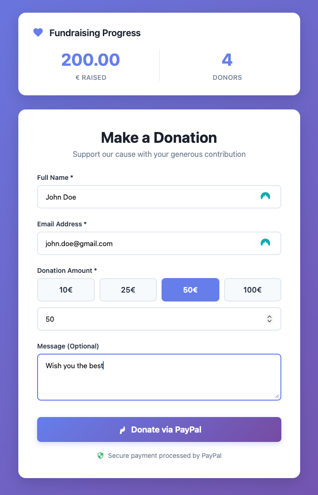
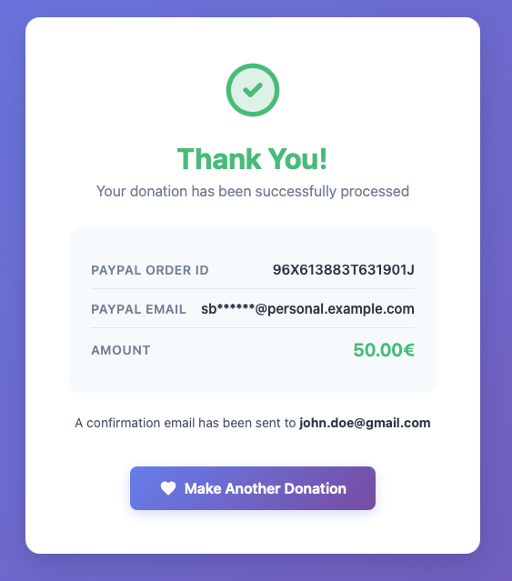

# Quarkus Donation App

> **Note:** This project was created primarily to explore and test Quarkus features.

Donation application with PayPal integration, built with Quarkus and PostgreSQL.

## Features

- Donation form with validation
- PayPal integration (sandbox)
- Server-side payment verification
- Real-time statistics (total donations and amounts)
- Responsive web interface

## Prerequisites

- Java 17+
- Maven 3.8+
- PostgreSQL 15+
- PayPal Developer account (for API credentials)

## Setup

### 1. Database

Create the PostgreSQL database:

```bash
psql -U root -d quarkus-donation-app -f src/main/resources/create-schema.sql
```

### 2. Environment Variables

Configure PayPal credentials:

```bash
export PAYPAL_CLIENT_ID=your_client_id
export PAYPAL_CLIENT_SECRET=your_client_secret
```

### 3. Configuration

Edit `src/main/resources/application.properties` if needed:

```properties
# Database
quarkus.datasource.jdbc.url=jdbc:postgresql://localhost:5432/quarkus-donation-app
quarkus.datasource.username=root
quarkus.datasource.password=root

# PayPal (sandbox by default)
quarkus.rest-client.paypal.url=https://api-m.sandbox.paypal.com

# App URL
app.base-url=http://localhost:8080
```

## Running

### Development mode

```bash
./mvnw quarkus:dev
```

Access the application at http://localhost:8080

## API Endpoints

- `GET /` - Donation form
- `POST /api/donations/paypal/initiate` - Initiate PayPal donation
- `GET /api/donations/paypal/return` - PayPal return handler (success/cancel)
- `GET /api/donations/stats` - Donation statistics

## Architecture

```
src/main/java/com/redhat/quarkus/donation/
├── dto/              # Data Transfer Objects
├── entity/           # JPA Entities (Donation, PayPalInfo)
├── repository/       # Panache Repositories
├── service/          # Business logic
├── rest/             # REST endpoints
├── integration/
│   └── paypal/       # PayPal REST client
└── mapper/           # DTO <-> Entity mappers
```

## Donation Flow

1. User fills out the form

    

2. POST to `/api/donations/paypal/initiate` creates a PayPal order
3. Redirect to PayPal for payment
4. Return to `/api/donations/paypal/return`
5. Status verification via PayPal API
6. Payment capture if approved
7. Result display

   

## Tech Stack

- Quarkus 3.x
- PostgreSQL 15
- Hibernate ORM / Panache
- PayPal REST API
- Qute Templates
- REST Client

## License

MIT